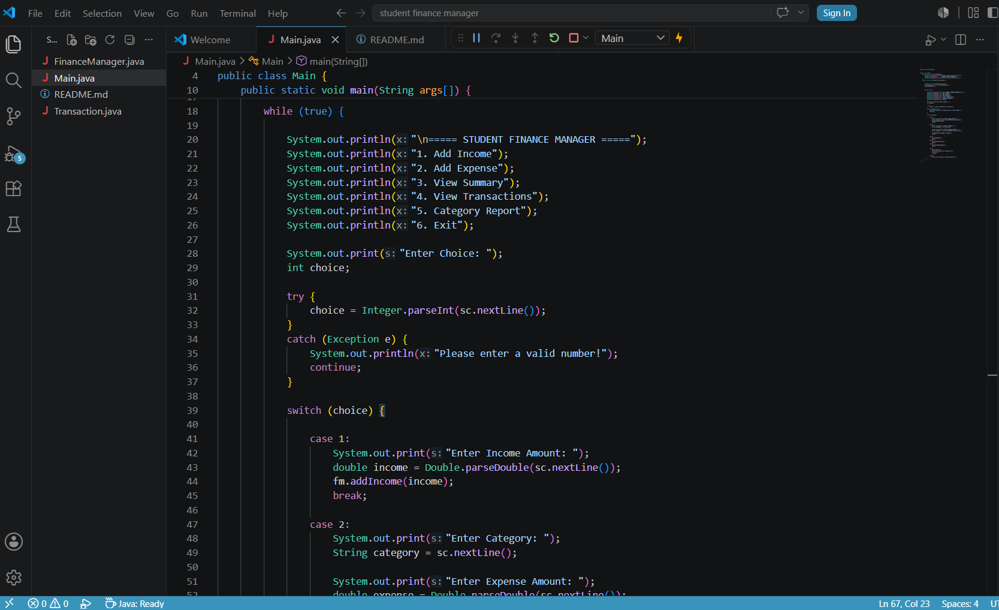
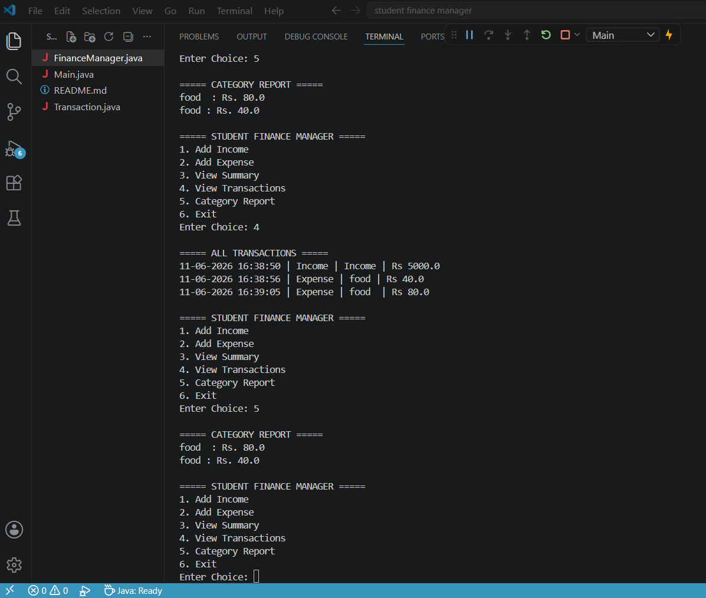
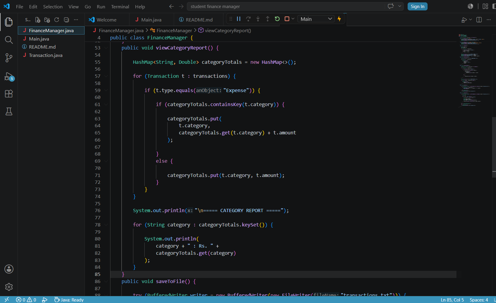

# Student Finance Manager

A Java console-based application for tracking personal income and expenses.

## Features

* Add Income
* Add Expenses
* View Financial Summary
* View All Transactions
* Category-wise Expense Report
* Save Transactions to File
* Load Transactions Automatically on Startup

## Technologies Used

* Java
* Object-Oriented Programming (OOP)
* File Handling
* ArrayList
* HashMap

## Project Structure

* Main.java
* FinanceManager.java
* Transaction.java

## How to Run

1. Compile all Java files.
2. Run Main.java.
3. Use the menu options to manage transactions.

## Sample Output

===== STUDENT FINANCE MANAGER =====

1. Add Income
2. Add Expense
3. View Summary
4. View Transactions
5. Category Report
6. Exit

## Screenshots

### Main Menu

### Output

### Category Report

## Author

Jayashree

